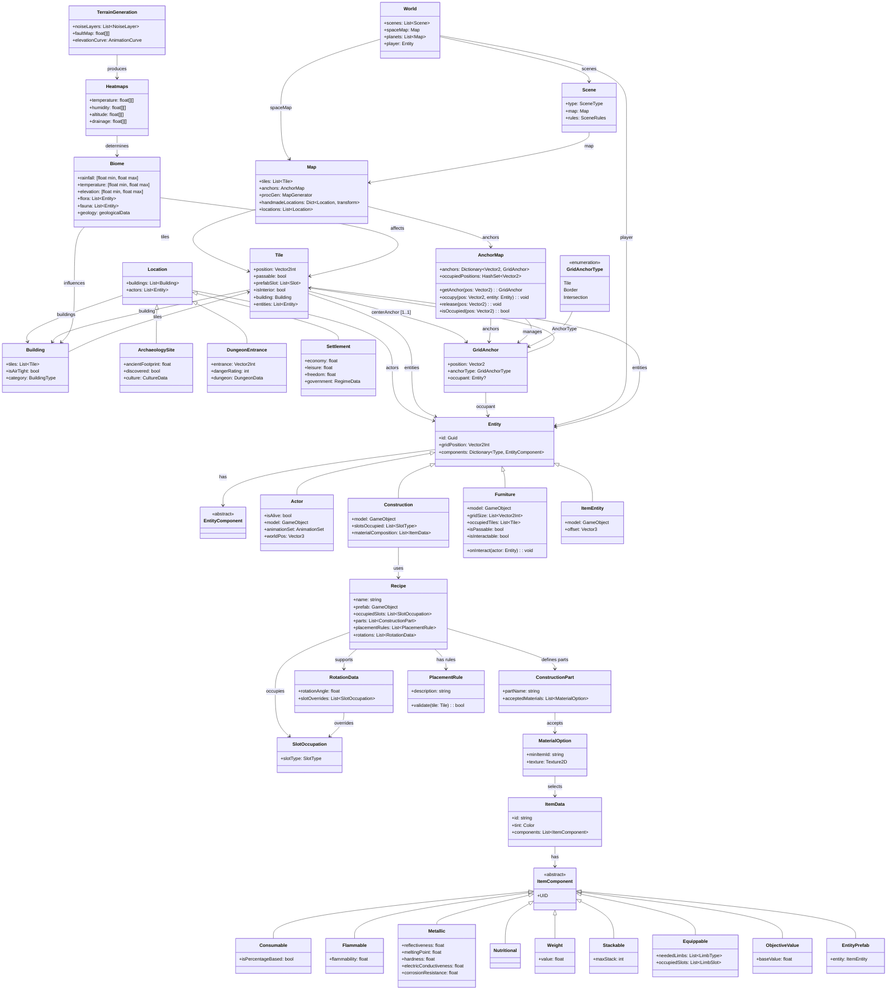

```mermaid
classDiagram
  direction TB

  %% World System
  class World {
    +scenes: List~Scene~
    +spaceMap: Map
    +planets: List~Map~
    +player: Entity
  }

  class Scene {
    +type: SceneType
    +map: Map
    +rules: SceneRules
  }

  class Map {
    +tiles: List~Tile~
    +anchors: AnchorMap
    +procGen: MapGenerator
    +handmadeLocations: Dict~Location, transform~
    +locations: List~Location~
  }

  World --> Scene : scenes
  World --> Map : spaceMap
  Scene --> Map : map
  Map --> Tile : tiles
  Map --> AnchorMap : anchors

  %% Terrain Generation
  class TerrainGeneration {
    +noiseLayers: List~NoiseLayer~
    +faultMap: float[][]
    +elevationCurve: AnimationCurve
  }

  class Heatmaps {
    +temperature: float[][]
    +humidity: float[][]
    +altitude: float[][]
    +drainage: float[][]
  }

  class Biome {
    +rainfall: [float min, float max]
    +temperature: [float min, float max]
    +elevation: [float min, float max]
    +flora: List~Entity~
    +fauna: List~Entity~
    +geology: geologicalData
  }

  TerrainGeneration --> Heatmaps : produces
  Heatmaps --> Biome : determines

  %% Map Components
  class Location {
    +buildings: List~Building~
    +actors: List~Entity~
  }

  class Tile {
    +position: Vector2Int
    +passable: bool
    +prefabSlot: List~Slot~
    +isInterior: bool
    +building: Building
    +entities: List~Entity~
  }

  class Building {
    +tiles: List~Tile~
    +isAirTight: bool
    +category: BuildingType
  }

  class ArchaeologySite {
    +ancientFootprint: float
    +discovered: bool
    +culture: CultureData
  }

  class DungeonEntrance {
    +entrance: Vector2Int
    +dangerRating: int
    +dungeon: DungeonData
  }

  class Settlement {
    +economy: float
    +leisure: float
    +freedom: float
    +government: RegimeData
  }

  Location --> Building : buildings
  Location --> Entity : actors
  Tile --> Building : building
  Tile --> Entity : entities
  Building --> Tile : tiles
  Biome --> Tile : affects
  Biome --> Building : influences

  Location <|-- ArchaeologySite
  Location <|-- DungeonEntrance
  Location <|-- Settlement

  %% Grid Anchor System
  class GridAnchor {
    +position: Vector2
    +anchorType: GridAnchorType
    +occupant: Entity?
  }

  class GridAnchorType {
    <<enumeration>>
    Tile
    Border
    Intersection
  }

  class AnchorMap {
    +anchors: Dictionary~Vector2, GridAnchor~
    +occupiedPositions: HashSet~Vector2~
    +getAnchor(pos: Vector2): GridAnchor
    +occupy(pos: Vector2, entity: Entity): void
    +release(pos: Vector2): void
    +isOccupied(pos: Vector2): bool
  }

  Tile --> GridAnchor : centerAnchor [1..1]
  GridAnchor --> Tile : tile [0..1]
  AnchorMap --> GridAnchor : anchors
  GridAnchor --> Entity : occupant
  AnchorMap --> GridAnchor : manages
  GridAnchorType --> GridAnchor : AnchorType

  %% Entity System
  class Entity {
    +id: Guid
    +gridPosition: Vector2Int
    +components: Dictionary~Type, EntityComponent~
  }

  class EntityComponent {
    <<abstract>>
  }

  class Actor {
    +isAlive: bool
    +model: GameObject
    +animationSet: AnimationSet
    +worldPos: Vector3
  }

  class Construction {
    +model: GameObject
    +slotsOccupied: List~SlotType~
    +materialComposition: List~ItemData~
  }

  class Furniture {
    +model: GameObject
    +gridSize: List~Vector2Int~
    +occupiedTiles: List~Tile~
    +isPassable: bool
    +isInteractable: bool
    +onInteract(actor: Entity): void
  }

  class ItemEntity {
    +model: GameObject
    +offset: Vector3
  }

  Entity <|-- Actor
  Entity <|-- Construction
  Entity <|-- Furniture
  Entity <|-- ItemEntity
  Entity --> EntityComponent : has
  World --> Entity : player
  Tile --> Entity : entities

  %% Construction Recipes & Materials
  class Recipe {
    +name: string
    +prefab: GameObject
    +occupiedSlots: List~SlotOccupation~
    +parts: List~ConstructionPart~
    +placementRules: List~PlacementRule~
    +rotations: List~RotationData~
  }

  class SlotOccupation {
    +slotType: SlotType
  }

  class ConstructionPart {
    +partName: string
    +acceptedMaterials: List~MaterialOption~
  }

  class MaterialOption {
    +minItemId: string
    +texture: Texture2D
  }

  class RotationData {
    +rotationAngle: float
    +slotOverrides: List~SlotOccupation~
  }

  class PlacementRule {
    +description: string
    +validate(tile: Tile): bool
  }

  Construction --> Recipe : uses
  Recipe --> SlotOccupation : occupies
  Recipe --> ConstructionPart : defines parts
  Recipe --> PlacementRule : has rules
  Recipe --> RotationData : supports
  ConstructionPart --> MaterialOption : accepts
  RotationData --> SlotOccupation : overrides

  %% Item System
  class ItemData {
    +id: string
    +tint: Color
    +components: List~ItemComponent~
  }

  class ItemComponent {
    <<abstract>>
    +UID
  }

  class Consumable {
    +isPercentageBased: bool
  }

  class Flammable {
    +flammability: float
  }

  class Metallic {
    +reflectiveness: float
    +meltingPoint: float
    +hardness: float
    +electricConductiveness: float
    +corrosionResistance: float
  }

  class Nutritional
  class Weight {
    +value: float
  }

  class Stackable {
    +maxStack: int
  }

  class Equippable {
    +neededLimbs: List~LimbType~
    +occupiedSlots: List~LimbSlot~
  }

  class ObjectiveValue {
    +baseValue: float
  }

  class EntityPrefab {
    +entity: ItemEntity
  }

  ItemData --> ItemComponent : has
  ItemComponent <|-- Consumable
  ItemComponent <|-- Flammable
  ItemComponent <|-- Metallic
  ItemComponent <|-- Nutritional
  ItemComponent <|-- Weight
  ItemComponent <|-- Stackable
  ItemComponent <|-- Equippable
  ItemComponent <|-- ObjectiveValue
  ItemComponent <|-- EntityPrefab
  MaterialOption --> ItemData : selects
```

