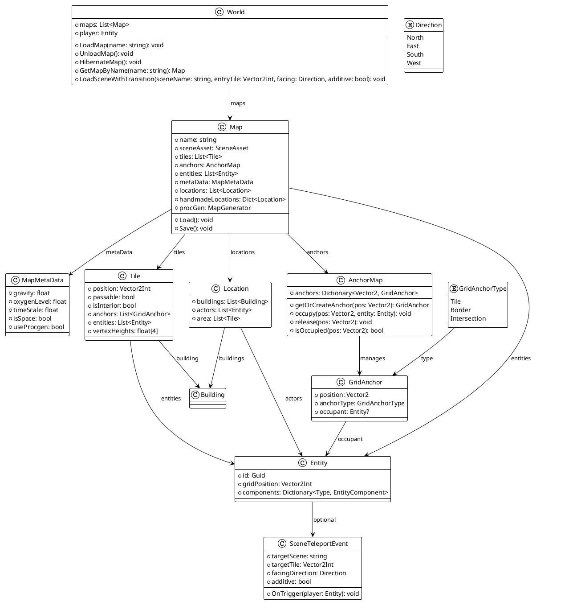

``` plantuml-svg
@startuml
!theme plain

' ========================
' WORLD / MAP / SCENE SYSTEM
' ========================

class World {
  + maps: List<Map>
  + player: Entity
  + LoadMap(name: string): void
  + UnloadMap(): void
  + HibernateMap(): void
  + GetMapByName(name: string): Map
  + LoadSceneWithTransition(sceneName: string, entryTile: Vector2Int, facing: Direction, additive: bool): void
}

class Map {
  + name: string
  + sceneAsset: SceneAsset
  + tiles: List<Tile>
  + anchors: AnchorMap
  + entities: List<Entity>
  + metaData: MapMetaData
  + locations: List<Location>
  + handmadeLocations: Dict<Location>
  + procGen: MapGenerator
  + Load(): void
  + Save(): void
}

class MapMetaData {
  + gravity: float
  + oxygenLevel: float
  + timeScale: float
  + isSpace: bool
  + useProcgen: bool
}

class Tile {
  + position: Vector2Int
  + passable: bool
  + isInterior: bool
  + anchors: List<GridAnchor>
  + entities: List<Entity>
  + vertexHeights: float[4]
}

class AnchorMap {
  + anchors: Dictionary<Vector2, GridAnchor>
  + getOrCreateAnchor(pos: Vector2): GridAnchor
  + occupy(pos: Vector2, entity: Entity): void
  + release(pos: Vector2): void
  + isOccupied(pos: Vector2): bool
}

class GridAnchor {
  + position: Vector2
  + anchorType: GridAnchorType
  + occupant: Entity?
}

enum GridAnchorType {
  Tile
  Border
  Intersection
}

class Location {
  + buildings: List<Building>
  + actors: List<Entity>
  + area: List<Tile>
}

class Entity {
  + id: Guid
  + gridPosition: Vector2Int
  + components: Dictionary<Type, EntityComponent>
}

class SceneTeleportEvent {
  + targetScene: string
  + targetTile: Vector2Int
  + facingDirection: Direction
  + additive: bool
  + OnTrigger(player: Entity): void
}

enum Direction {
  North
  East
  South
  West
}

World --> Map : maps
Map --> Tile : tiles
Map --> AnchorMap : anchors
Map --> Entity : entities
Map --> MapMetaData : metaData
Tile --> Entity : entities
Tile --> Building : building
Map --> Location : locations
Location --> Entity : actors
Location --> Building : buildings
GridAnchor --> Entity : occupant
AnchorMap --> GridAnchor : manages
GridAnchorType --> GridAnchor : type
Entity --> SceneTeleportEvent : optional
@enduml
```

![[World-Map Diagram.png]]