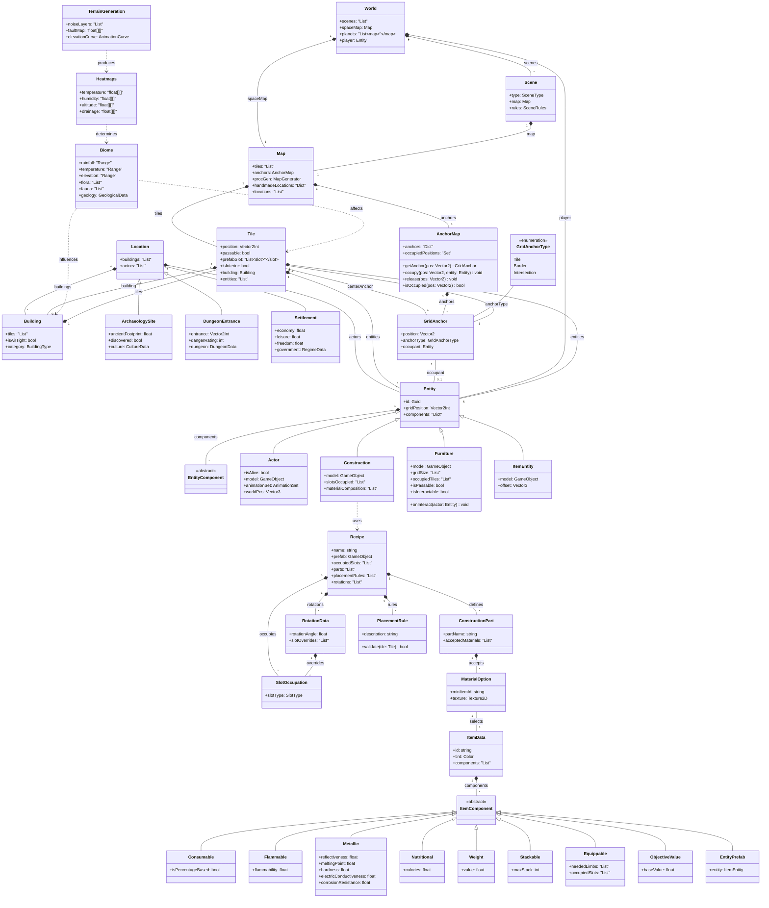

```mermaid
classDiagram
  %% World System
  class World {
    +scenes: "List<Scene>"
    +spaceMap: Map
    +planets: "List<Map>"
    +player: Entity
  }

  class Scene {
    +type: SceneType
    +map: Map
    +rules: SceneRules
  }

  class Map {
    +tiles: "List<Tile>"
    +anchors: AnchorMap
    +procGen: MapGenerator
    +handmadeLocations: "Dict<Location, Transform>"
    +locations: "List<Location>"
  }

  World "1" *-- "*" Scene : scenes
  World "1" *-- "1" Map : spaceMap
  Scene "1" *-- "1" Map : map
  Map "1" *-- "*" Tile : tiles
  Map "1" *-- "1" AnchorMap : anchors

  %% Terrain Generation
  class TerrainGeneration {
    +noiseLayers: "List<NoiseLayer>"
    +faultMap: "float[][]"
    +elevationCurve: AnimationCurve
  }

  class Heatmaps {
    +temperature: "float[][]"
    +humidity: "float[][]"
    +altitude: "float[][]"
    +drainage: "float[][]"
  }

  class Biome {
    +rainfall: "Range"
    +temperature: "Range"
    +elevation: "Range"
    +flora: "List<Entity>"
    +fauna: "List<Entity>"
    +geology: GeologicalData
  }

  TerrainGeneration ..> Heatmaps : produces
  Heatmaps ..> Biome : determines

  %% Map Components
  class Location {
    +buildings: "List<Building>"
    +actors: "List<Entity>"
  }

  class Tile {
    +position: Vector2Int
    +passable: bool
    +prefabSlot: "List<Slot>"
    +isInterior: bool
    +building: Building
    +entities: "List<Entity>"
  }

  class Building {
    +tiles: "List<Tile>"
    +isAirTight: bool
    +category: BuildingType
  }

  class ArchaeologySite {
    +ancientFootprint: float
    +discovered: bool
    +culture: CultureData
  }

  class DungeonEntrance {
    +entrance: Vector2Int
    +dangerRating: int
    +dungeon: DungeonData
  }

  class Settlement {
    +economy: float
    +leisure: float
    +freedom: float
    +government: RegimeData
  }

  Location "1" *-- "*" Building : buildings
  Location "1" *-- "*" Entity : actors
  Tile "1" *-- "0..1" Building : building
  Tile "1" *-- "*" Entity : entities
  Building "1" *-- "*" Tile : tiles
  Biome ..> Tile : affects
  Biome ..> Building : influences

  Location <|-- ArchaeologySite
  Location <|-- DungeonEntrance
  Location <|-- Settlement

  %% Grid Anchor System
  class GridAnchor {
    +position: Vector2
    +anchorType: GridAnchorType
    +occupant: Entity
  }

  class GridAnchorType {
    <<enumeration>>
    Tile
    Border
    Intersection
  }

  class AnchorMap {
    +anchors: "Dict<Vector2, GridAnchor>"
    +occupiedPositions: "Set<Vector2>"
    +getAnchor(pos: Vector2) GridAnchor
    +occupy(pos: Vector2, entity: Entity) void
    +release(pos: Vector2) void
    +isOccupied(pos: Vector2) bool
  }

  Tile "1" -- "1" GridAnchor : centerAnchor
  GridAnchor "1" -- "0..1" Tile : tile
  AnchorMap "1" *-- "*" GridAnchor : anchors
  GridAnchor "1" -- "0..1" Entity : occupant
  GridAnchorType -- GridAnchor : anchorType

  %% Entity System
  class Entity {
    +id: Guid
    +gridPosition: Vector2Int
    +components: "Dict<Type, EntityComponent>"
  }

  class EntityComponent {
    <<abstract>>
  }

  class Actor {
    +isAlive: bool
    +model: GameObject
    +animationSet: AnimationSet
    +worldPos: Vector3
  }

  class Construction {
    +model: GameObject
    +slotsOccupied: "List<SlotType>"
    +materialComposition: "List<ItemData>"
  }

  class Furniture {
    +model: GameObject
    +gridSize: "List<Vector2Int>"
    +occupiedTiles: "List<Tile>"
    +isPassable: bool
    +isInteractable: bool
    +onInteract(actor: Entity) void
  }

  class ItemEntity {
    +model: GameObject
    +offset: Vector3
  }

  Entity <|-- Actor
  Entity <|-- Construction
  Entity <|-- Furniture
  Entity <|-- ItemEntity
  Entity "1" *-- "*" EntityComponent : components
  World "1" *-- "1" Entity : player
  Tile "1" *-- "*" Entity : entities

  %% Construction Recipes & Materials
  class Recipe {
    +name: string
    +prefab: GameObject
    +occupiedSlots: "List<SlotOccupation>"
    +parts: "List<ConstructionPart>"
    +placementRules: "List<PlacementRule>"
    +rotations: "List<RotationData>"
  }

  class SlotOccupation {
    +slotType: SlotType
  }

  class ConstructionPart {
    +partName: string
    +acceptedMaterials: "List<MaterialOption>"
  }

  class MaterialOption {
    +minItemId: string
    +texture: Texture2D
  }

  class RotationData {
    +rotationAngle: float
    +slotOverrides: "List<SlotOccupation>"
  }

  class PlacementRule {
    +description: string
    +validate(tile: Tile) bool
  }

  Construction ..> Recipe : uses
  Recipe "1" *-- "*" SlotOccupation : occupies
  Recipe "1" *-- "*" ConstructionPart : defines
  Recipe "1" *-- "*" PlacementRule : rules
  Recipe "1" *-- "*" RotationData : rotations
  ConstructionPart "1" *-- "*" MaterialOption : accepts
  RotationData "1" *-- "*" SlotOccupation : overrides

  %% Item System
  class ItemData {
    +id: string
    +tint: Color
    +components: "List<ItemComponent>"
  }

  class ItemComponent {
    <<abstract>>
  }

  class Consumable {
    +isPercentageBased: bool
  }

  class Flammable {
    +flammability: float
  }

  class Metallic {
    +reflectiveness: float
    +meltingPoint: float
    +hardness: float
    +electricConductiveness: float
    +corrosionResistance: float
  }

  class Nutritional {
    +calories: float
  }
  
  class Weight {
    +value: float
  }

  class Stackable {
    +maxStack: int
  }

  class Equippable {
    +neededLimbs: "List<LimbType>"
    +occupiedSlots: "List<LimbSlot>"
  }

  class ObjectiveValue {
    +baseValue: float
  }

  class EntityPrefab {
    +entity: ItemEntity
  }

  ItemData "1" *-- "*" ItemComponent : components
  ItemComponent <|-- Consumable
  ItemComponent <|-- Flammable
  ItemComponent <|-- Metallic
  ItemComponent <|-- Nutritional
  ItemComponent <|-- Weight
  ItemComponent <|-- Stackable
  ItemComponent <|-- Equippable
  ItemComponent <|-- ObjectiveValue
  ItemComponent <|-- EntityPrefab
  MaterialOption "1" -- "1" ItemData : selects
```

